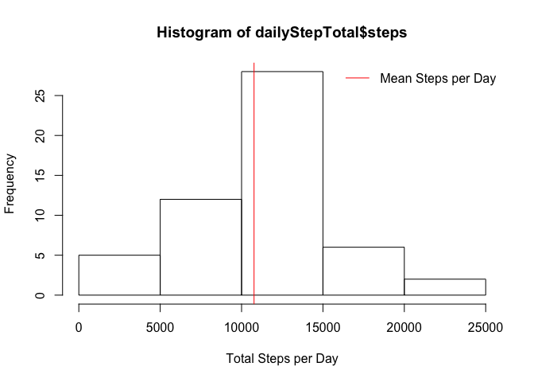
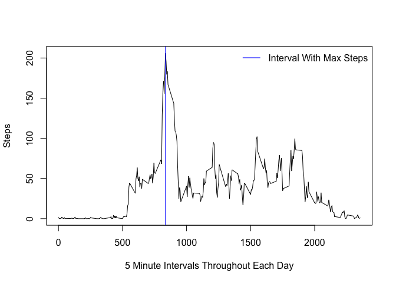
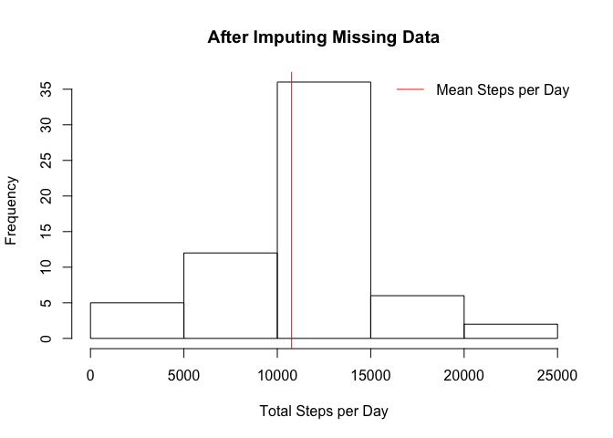

## Loading and preprocessing the data


```r
if (!file.exists ("activity.csv"))
  unzip ("activity.zip")
act <- read.csv ("activity.csv")
```

## What is mean total number of steps taken per day?


```r
dailyStepTotal <- aggregate (. ~ date, data = act, sum)
hist (dailyStepTotal$steps, xlab = "Total Steps per Day")
abline (v = mean (dailyStepTotal$steps), col = "red")
legend ("topright", lty = 1, bty = "n", col = "red", legend = "Mean Steps per Day")
```

<!-- -->

```r
# There are up to five significant digits in each number; by reporting integers, we keep that 
#   relatively taken care of
meanStepsPerDay <- sprintf ("%.0f", mean (dailyStepTotal$steps))
medianStepsPerDay <- sprintf ("%.0f",median (dailyStepTotal$steps))
```

Mean steps per day: 10766  
Median steps per day: 10765


## What is the average daily activity pattern?


```r
stepsEachInterval <- aggregate (steps ~ interval, data = act, mean)
with (stepsEachInterval, plot (interval, steps, type = "l", 
      xlab = "5 Minute Intervals Throughout Each Day", ylab = "Steps"))

rowNum <- which (stepsEachInterval$steps == max (stepsEachInterval$steps))
intervalWithMaxSteps <- stepsEachInterval$interval[rowNum]

abline (v = intervalWithMaxSteps, col = "blue")
legend ("topright", lty = 1, bty = "n", col = "blue", legend = "Interval With Max Steps")
```

<!-- -->

The interval number with the maximum average number of steps is: 835.

## Imputing missing values


```r
numMissingValues <- sum (is.na(act$steps))
```

Total number of missing values: 2304.  


```r
# Strategy for imputing missing values: use average for that interval over all days in dataset
#   Create a reverse lookup vector so that we can get the average steps for a given interval, given the interval
#   intervals start with 0, vectors start with 1, so I'm looking up (interval + 1) in the vector
avgLookupVector <- rep (0L, max (stepsEachInterval$interval) + 1)
for (i in 1:length (stepsEachInterval$steps)) {
  interval <- stepsEachInterval$interval[i]
  avgLookupVector[interval+1] <- stepsEachInterval$steps[i]
}
imputedAct <- act
for (i in 1:length (imputedAct$steps)) {
  if (is.na (imputedAct$steps[i])) {
      imputedAct$steps[i] <- avgLookupVector[imputedAct$interval[i] + 1]
  }
}

dailyStepTotal <- aggregate (. ~ date, data = imputedAct, sum)
hist (dailyStepTotal$steps, main = "After Imputing Missing Data", xlab = "Total Steps per Day")
abline (v = mean (dailyStepTotal$steps), col = "red")
legend ("topright", lty = 1, bty = "n", col = "red", legend = "Mean Steps per Day")
```

<!-- -->

```r
meanStepsPerDay <- sprintf ("%.0f", mean (dailyStepTotal$steps))
medianStepsPerDay <- sprintf ("%.0f",median (dailyStepTotal$steps))
```

Mean steps per day, using imputed missing values: 10766  
Median steps per day, using imputed missing values: 10766

These values do not differ significantly from those in the first part of the assignment.  
Imputing missing data on the estimates of the total daily number of steps made no significant difference.

## Are there differences in activity patterns between weekdays and weekends?
